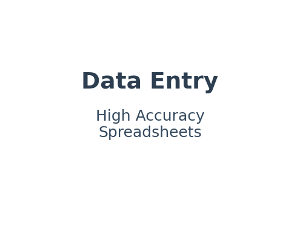

# Robert Fruchtman – Freelance Portfolio

**5-Star Rated | 5+ Clients | Multiple Repeat Customers**

I specialize in delivering **Data Entry, Bookkeeping, WordPress, AI/Automation, and SQL/Python** solutions with proven client satisfaction.  
My work has earned multiple 5-star reviews, repeat hires, and even new clients joining Upwork specifically to work with me.

---

## 📂 Portfolio Projects

Below are examples of projects I’ve completed for clients across multiple industries, showcasing a mix of technical skill, attention to detail, and client-focused delivery.

---

### 1. Bookkeeping & Monthly Financial Reconciliation – Repeat Client Project
**Skills:** Bookkeeping, Excel, Financial Reporting, Data Entry  
**Description:**  
Reconciled monthly business finances including expense categorization, bank statement matching, and account balancing. Delivered organized reports that improved financial tracking and decision-making.  
**Results:** Client returned for 3 additional projects within 2 months.  

---

### 2. Data Entry – High Accuracy Spreadsheets for Repeat Client
**Skills:** Data Entry, Excel, Spreadsheet Management, Accuracy Verification  
**Description:**  
Cleaned and standardized large datasets while removing duplicates and ensuring 100% accuracy.  
**Results:** Repeat client hired me for multiple rounds of database cleanup, improving data accuracy across their operations.  

---

### 3. AI Document Categorization Tool – Automation Project
**Skills:** Python, Automation, Machine Learning, NLP, Data Processing  
**Description:**  
Built a Python-based AI tool to process PDF, DOCX, and DOC files, automatically categorizing documents by content and exporting results to CSV.  
**Results:** Reduced manual classification time to near zero, allowing the client to process hundreds of documents in minutes.  

---

### 4. SQL/Python Data Extraction & Report Automation
**Skills:** SQL, Python, Data Analysis, Data Cleaning, Automation  
**Description:**  
Developed SQL queries and Python scripts to extract and process data from databases, producing actionable reports.  
**Results:** Reduced manual reporting time by 80% while improving data accuracy for decision-making.  

---

### 5. WordPress Site Edits & Maintenance – Improved UX & Security
**Skills:** WordPress, HTML/CSS, Content Updates, Site Maintenance  
**Description:**  
Provided ongoing WordPress maintenance including content updates, plugin management, and layout adjustments for better user experience and security.  
**Results:** Ensured site stability, improved load times, and enhanced user engagement.  

---

### 6. Invoice Entry Accuracy – PDF to Spreadsheet
**Skills:** Data Entry, Excel, Accuracy Verification  
**Description:**  
Converted PDF invoices into clean, structured spreadsheets for easier reporting and tracking.  
**Results:** Delivered 100% accuracy with faster turnaround times, reducing client workload significantly.  

---

## 🛠 Skills Overview
- **Data Entry & Bookkeeping:** Excel, Financial Reporting, Accuracy Verification  
- **Web Development:** WordPress, HTML/CSS, Content Management  
- **Automation & AI:** Python, Machine Learning, NLP, Data Processing  
- **Database Work:** SQL, Data Cleaning, Report Automation

---

📬 **Let’s Connect:**  
- [Upwork Profile](https://www.upwork.com/freelancers/yourprofileid)  
- [LinkedIn](https://www.linkedin.com/in/robertfruchtman/)  
- [Email](mailto:your@email.com)
